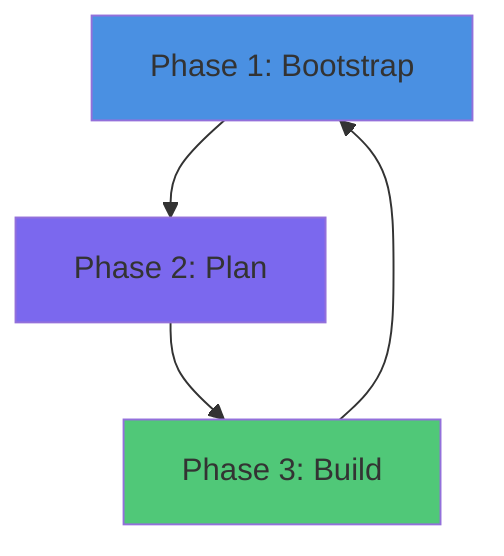

Version: 1.0.0

AgenticFlywheel Framework (Self‑Sustaining AI‑Human Development)

**Turn AI Development Chaos Into a Self-Sustaining Engine of Quality**

*Version 1.0.0 | Architecture-Agnostic | Prompt-First | Zero Dependencies*

---

## The 30-Second Version

**Before AgenticFlywheel:** Every AI feature is a snowflake—different patterns, skipped tests, missing docs, lost context. Six months later, nobody knows how anything works.

**After AgenticFlywheel:** Every feature follows the same bulletproof process—planned, tested, documented, and traceable. Each feature makes the next one 2-3x faster. Your codebase becomes self-documenting and AI-agent-friendly.

---

## The Problem: AI Development Is Broken

You've felt it. That initial rush of AI-powered velocity... followed by the slow realization that you're building a house of cards.

- **Inconsistent patterns**: Each feature reinvents the wheel—different error handling, different testing, different everything
- **Skipped steps**: AI "forgets" to write tests, update docs, or consider edge cases (because nothing enforces it)
- **Lost context**: Requirements vanish into chat history black holes—"Wait, why did we build it this way?"
- **Zero traceability**: Features exist in code but aren't mapped to contracts, flags, or metrics
- **Documentation drift**: Docs are outdated before the PR merges

**Result:** Fast today, unmaintainable tomorrow. Technical debt that compounds with every feature.

---

## The Game-Changer: A Self-Sustaining Flywheel

AgenticFlywheel doesn't just *suggest* a process—it **enforces** a systematic workflow that gets stronger with every feature you ship.

### The 5 Big Wins 

#### 1. **From Chaos to Clockwork**
Every feature follows the **exact same pattern**: Context → Plan → Develop → Test → Document. No more guessing. No more "how did we do this last time?"

#### 2. **The Compound Effect**
Each completed AIP (Agent Implementation Packet) becomes a building block for the next. Better docs → Better AI results → Better docs. By your 10th feature, you're **2-3x faster** than ad-hoc development.

#### 3. **Zero-Context Restartability**
New AI session? New team member? Pick up any feature in 30 seconds with `AGENT_PROMPT.txt`. No more "let me search the chat history" or "can you remind me..."

#### 4. **Quality That's Unskippable**
Tests, docs, and observability aren't optional—they're **structurally required**. The framework won't let you mark a feature complete until everything is documented and validated.

#### 5. **Complete Traceability**
Every feature is mapped in the Feature Registry with its contracts, flags, metrics, owners, and dependencies. "Where's the auth contract?" → **Line 23 of `REGISTRY.yaml`**

---

## How It Works: The 3-Phase Transformation



### **Phase 1: Bootstrap (One-Time, 15-30 min)**
Run the wizard. It interviews you about your architecture, then generates your entire documentation foundation—coding standards, testing rules, security policies, and a Feature Registry. You get **immediate value** with your first real AIP.

### **Phase 2: Plan (Per Feature, 10-20 min)**
Run `AIP_COLLAB.md`. The AI guides you through a structured Q&A—objectives, contracts, risks, acceptance criteria. You review a diff, approve it, and get a **complete implementation packet** with checklists, contracts, and test plans.

### **Phase 3: Build (Enforced Execution)**
The AI follows `CHECKLIST.yaml` like a recipe—Design → Backend → Frontend → Testing → **Docs & Handoff** (mandatory). Each phase has validation gates. Skip a step? The checklist validator catches it.

---

## What You Get: Your Complete System

### 📦 **The Core Framework**
- **Context Your AI Needs**: AFW establishes core context about your project that drives amazing results
- **AIP Templates**: Full and lightweight versions for any feature size
- **Feature Registry**: Single source of truth for all features, flags, and contracts
- **Validation Prompts**: Checklist validators, registry validators, dependency analyzers
- **Agent Configs**: Enhanced configs for Claude, Codex, Cursor

### 📚 **Your Tailored Documentation Constitution**
The wizard generates these from your architecture interview:
- `CODING-STANDARD.md` - Your language idioms and anti-patterns
- `TESTING-STANDARDS.md` - Test pyramid, coverage targets, CI commands
- `PLATFORM-ARCHITECTURE.md` - Your boundaries and "illegal moves"
- `API-DOCUMENTATION.md` - Versioning, schemas, error models
- `SECURITY.md` - Auth models, PII handling, secrets
- `OBSERVABILITY.md` - Metrics, logging, tracing conventions
- `ERROR-HANDLING.md` - Retry policies, circuit breakers
- `CONFIGURATION-MANAGEMENT.md` - Feature flags, env vars

### 🎯 **Real Results From Day One**
- **Feature traceability**: 100% of features mapped to contracts and metrics
- **Documentation coverage**: Tests and docs are non-negotiable
- **Onboarding time**: New AI agents productive in minutes, not hours
- **Technical debt**: Prevented at the source, not cleaned up later

---

## Quick Start: Your First AIP in 15 Minutes

```bash
# 1. Copy to your repo root
cp -r AgenticFlywheel/ ./

# 2. Run the bootstrap wizard in your AI tool
# Claude/Cursor/Codex: @AgenticFlywheel/prompts/SYSTEM_BOOTSTRAP.md

# 3. Answer 5-10 questions about your stack
# The wizard discovers your codebase and generates tailored docs

# 4. Choose your first real feature to AIP-ify
# The wizard guides you through creating your first packet

# 5. Done! You now have:
#    - Complete docs/ai/** foundation
#    - Your first feature AIP ready to implement
#    - AI agent configured for systematic development
```

**No scripts. No dependencies. No lock-in.** Works with any AI tool.

---

## The AIP Spectrum: Right-Size Your Process

Not every change needs a 50-page document. Choose the right tool:

| Type | When to Use | Time Investment |
|------|-------------|-----------------|
| **No AIP** | Bug fixes, typos, <3 file changes | 0 min (document in commit) |
| **Lightweight AIP** | Small features, single-sided changes | 10-15 min |
| **Full AIP** | Major features, contracts, multi-system | 20-30 min |

**Decision tree:**
```
Is it a bug or tiny change? → No AIP
├─ No → Is it <2 days and simple? → Lightweight AIP
    ├─ No → Full AIP
```

---

## Why This Works: The Invisible Enforcement

The magic isn't in the templates—it's in the **structural constraints** that make it impossible to skip steps:

1. **Required Phases**: `CHECKLIST.yaml` templates mandate Backend, Frontend, and Docs & Handoff
2. **Validation Gates**: Your agent automatically leverages `CHECKLIST_VALIDATOR.md`—it fails if tests or docs are missing
3. **Registry Updates**: Feature Registry must be updated during handoff—no feature is complete without traceability
4. **Dependency Tracking**: AI automatically analyzes impact before modifications
5. **Prompt-Based**: No scripts to bypass—AI agents follow the structure because it's the only path

**Result:** AI agents can't "forget" to write tests or skip docs. The framework guides them to consistency.

---

## FAQ: The Hard Questions

**Q: Does this slow us down?**  
A: Initially, yes—by 15-30 minutes for your first AIP. But you eliminate rework, prevent technical debt, and by your 10th feature, you're **2-3x faster** with higher quality.

**Q: What if we skip the "Docs & Handoff" phase?**  
A: Don't. That's like skipping the foundation of a building. The flywheel breaks, docs drift, and you're back to chaos. This phase is what makes the system self-sustaining.

**Q: How is this different from just "being more disciplined"?**  
A: Discipline fails when you're moving fast. AgenticFlywheel **enforces** the discipline through structure and validation—like guardrails, not guidelines.

**Q: Can we adapt this to our existing workflow?**  
A: Yes. The wizard interviews you about your actual process and generates docs that match your reality—not some idealized version. It merges with existing docs and respects your boundaries.

**Q: Do we need to install anything?**  
A: **Zero dependencies.** It's prompt-based. Copy the folder and run the prompts in your existing AI tool. That's it.

---

## The Bottom Line

AgenticFlywheel transforms AI development from **artisanal chaos** to **industrial-grade consistency**. It's not about adding process for process's sake—it's about building a system where each feature strengthens the next, documentation stays current automatically, and you can hand off to any AI agent (or human) with zero context loss.

**Your codebase becomes a self-improving system.** That's the flywheel effect.

---

## Next Step: Run the Bootstrap Wizard

Copy this framework into your repo and run:

```
@AgenticFlywheel/prompts/SYSTEM_BOOTSTRAP.md
```

In 15 minutes, you'll have a complete documentation constitution and your first AIP ready to implement.

**Welcome to systematic AI development.** 🎯