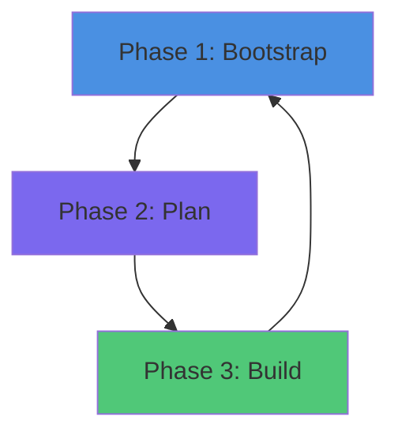

Version: 1.0.0

AgenticFlywheel Framework (Self‑Sustaining AI‑Human Development)

**Turn AI Development Chaos Into a Self-Sustaining Engine of Quality**

*Version 1.0.0 | Architecture-Agnostic | Prompt-First | Zero Dependencies*

---

## The 30-Second Version

**Before AgenticFlywheel:** Every AI feature is a snowflake—different patterns, skipped tests, missing docs, lost context. Six months later, nobody knows how anything works.

**After AgenticFlywheel:** Every feature follows the same bulletproof process—planned, tested, documented, and traceable. Each feature makes the next one 2-3x faster. Your codebase becomes self-documenting and AI-agent-friendly.

---

## The Problem: AI Development Is Broken

You've felt it. That initial rush of AI-powered velocity... followed by the slow realization that you're building a house of cards.

- **Inconsistent patterns**: Each feature reinvents the wheel—different error handling, different testing, different everything
- **Skipped steps**: AI "forgets" to write tests, update docs, or consider edge cases (because nothing enforces it)
- **Lost context**: Requirements vanish into chat history black holes—"Wait, why did we build it this way?"
- **Zero traceability**: Features exist in code but aren't mapped to contracts, flags, or metrics
- **Documentation drift**: Docs are outdated before the PR merges

**Result:** Fast today, unmaintainable tomorrow. Technical debt that compounds with every feature.

---

## The Game-Changer: A Self-Sustaining Flywheel

AgenticFlywheel doesn't just *suggest* a process—it **enforces** a systematic workflow that gets stronger with every feature you ship.

### The 5 Big Wins 

#### 1. **From Chaos to Clockwork**
Every feature follows the **exact same pattern**: Context → Plan → Develop → Test → Document. No more guessing. No more "how did we do this last time?"

#### 2. **The Compound Effect**
Each completed AIP (Agent Implementation Packet) becomes a building block for the next. Better docs → Better AI results → Better docs. By your 10th feature, you're **2-3x faster** than ad-hoc development.

#### 3. **Zero-Context Restartability**
New AI session? New team member? Pick up any feature in 30 seconds with `AGENT_PROMPT.txt`. No more "let me search the chat history" or "can you remind me..."

#### 4. **Quality That's Unskippable**
Tests, docs, and observability aren't optional—they're **structurally required**. The framework won't let you mark a feature complete until everything is documented and validated.

#### 5. **Complete Traceability**
Every feature is mapped in the Feature Registry with its contracts, flags, metrics, owners, and dependencies. "Where's the auth contract?" → **Line 23 of `REGISTRY.yaml`**

---

## How It Works: The 3-Phase Transformation


```mermaid
graph TD
    A[Phase 1: Bootstrap] --> B[Phase 2: Plan]
    B --> C[Phase 3: Build]
    C --> A
    
    style A fill:#4a90e2
    style B fill:#7b68ee
    style C fill:#50c878
```

### **Phase 1: Bootstrap (One-Time, 15-30 min)**
Run the wizard. It interviews you about your architecture, then generates your entire documentation foundation—coding standards, testing rules, security policies, and a Feature Registry. You get **immediate value** with your first real AIP.

### **Phase 2: Plan (Per Feature, 10-20 min)**
Run `OFFICE_HOURS.md` and `AUTOPLAN.md` to pressure-test the problem, then `AIP_COLLAB.md` to turn the accepted conclusions into a packet. You review a diff, approve it, and get a **complete implementation packet** with reviews, checklists, contracts, and test plans.

### **Phase 3: Build (Enforced Execution)**
The AI follows `CHECKLIST.yaml` like a recipe—Design → Backend → Frontend → Testing → **Docs & Handoff** → **Implementation Audit** → closure. `PRELANDING_REVIEW.md`, `IMPLEMENTATION_AUDIT.md`, `QA.md`, and `SHIP.md` form the execution-time gauntlet. Audit findings update the packet, create remediation work, require targeted re-verification, and block completion until resolved. Skip a step? The checklist validator catches it.

---

## What You Get: Your Complete System

### 📦 **The Core Framework**
- **Context Your AI Needs**: AFW establishes core context about your project that drives amazing results
- **AIP Templates**: Full and lightweight versions for any feature size
- **Runtime Layer**: Local-first checkpoints, learnings, review logs, and host routing under `.agentic-flywheel/state/`
- **Feature Registry**: Single source of truth for all features, flags, and contracts
- **Validation Prompts**: Checklist validators, registry validators, dependency analyzers
- **Implementation Audit Gate**: Required post-implementation audit with security, architecture, QA, frontend, database, agentic AI, product, and DevEx review personas
- **Agent Configs**: Enhanced configs for Claude, Codex, Cursor
- **Claude Code Native Assets**: Project-skill templates and a reusable plugin scaffold for AFW workflows

### 📚 **Your Tailored Documentation Constitution**
The wizard generates these from your architecture interview:
- `CODING-STANDARD.md` - Your language idioms and anti-patterns
- `TESTING-STANDARDS.md` - Test pyramid, coverage targets, CI commands
- `PLATFORM-ARCHITECTURE.md` - Your boundaries and "illegal moves"
- `API-DOCUMENTATION.md` - Versioning, schemas, error models
- `SECURITY.md` - Auth models, PII handling, secrets
- `OBSERVABILITY.md` - Metrics, logging, tracing conventions
- `ERROR-HANDLING.md` - Retry policies, circuit breakers
- `CONFIGURATION-MANAGEMENT.md` - Feature flags, env vars

### 🎯 **Real Results From Day One**
- **Feature traceability**: 100% of features mapped to contracts and metrics
- **Documentation coverage**: Tests and docs are non-negotiable
- **Onboarding time**: New AI agents productive in minutes, not hours
- **Technical debt**: Prevented at the source, not cleaned up later

---

## Quick Start: Your First AIP in 15 Minutes

```bash
# 1. Copy to your repo root
cp -r AgenticFlywheel/ ./

# 2. Run the bootstrap wizard in your AI tool
# Claude/Cursor/Codex: @AgenticFlywheel/prompts/SYSTEM_BOOTSTRAP.md

# 3. Answer 5-10 questions about your stack
# The wizard discovers your codebase and generates tailored docs

# 4. Choose your first real feature to AIP-ify
# The wizard guides you through creating your first packet

# 5. Done! You now have:
#    - Complete docs/ai/** foundation
#    - Your first feature AIP ready to implement
#    - AI agent configured for systematic development
```

**No scripts. No dependencies. No lock-in.** Works with any AI tool.

## Claude Code Native Use

AFW now has two Claude-native integration modes:

**Project skill**:
- Install `templates/config/.claude/CLAUDE.md`
- Install `templates/config/.claude/skills/agentic-flywheel/`
- This is the recommended default for repos that vendor AFW locally

**Plugin scaffold**:
- Use `templates/claude-plugin/agentic-flywheel/`
- This gives you namespaced native commands such as:
  - `/agentic-flywheel:bootstrap`
  - `/agentic-flywheel:create-aip <feature-slug>`
  - `/agentic-flywheel:validate-checklist <path-or-feature-slug>`
  - `/agentic-flywheel:generate-agent-prompt <feature-slug>`

Recommended Claude split:
- Put stable repo facts in `.claude/CLAUDE.md`
- Put repeatable AFW procedures in `.claude/skills/agentic-flywheel/`
- Keep `AGENT_PROMPT.txt` as the zero-context handoff artifact inside each completed AIP, refreshing it if audit-driven packet changes affect execution instructions
- Start new packet requests with active collaboration; every full and lite AIP records a `Collaboration Summary` and includes a `collaboration-readiness` checklist task before implementation
- Treat a detailed new-AIP request as seed context, not completed collaboration; packet writes, `collaboration-readiness: completed`, and implementation wait for user-confirmed summary evidence or an explicit direct/template-only scaffold exception
- Run `IMPLEMENTATION_AUDIT.md` before packet closure; accepted findings must be fixed or explicitly dispositioned and re-verified before completion

Routing note:
- Generic requests like `new AIP` should start the AIP flow and default to `AIP_COLLAB.md` for active collaboration and user-confirmed planning.
- Use `AIP_NEW.md` only when the user explicitly wants direct scaffolding or accepted planning artifacts already satisfy the collaboration readiness gate.
- A specific feature description can shorten the collaboration round, but it does not authorize immediate packet scaffolding or implementation.

---

## Step-by-Step Example: Create a New AIP

Below is a concrete, repeatable flow you can follow for any new feature.

### Example (Full AIP)
Feature: **period-insights-cards** (backend + frontend)

1) Choose the feature slug and scope
- Slug: `period-insights-cards`
- Scope: backend + frontend
- Size: full AIP

2) Run the guided AIP creation prompt
```
@AgenticFlywheel/prompts/AIP_COLLAB.md
```
Work with the AIP Collaboration Steward to confirm goals, scope, non-goals, acceptance, risks, rollout, and verification. The packet should not be written until the user confirms the Collaboration Summary and the Collaboration Readiness checklist is satisfied.

If the requirements are already settled and you only want the packet scaffold, use:
```
@AgenticFlywheel/prompts/AIP_NEW.md
```

3) Approve the generated packet
- The packet will live at:
  - `docs/Agent Implementation Packets/period-insights-cards/`
- Confirm that `CHECKLIST.yaml` includes real verification commands (tests/build/lint) for your repo.
- Confirm that `REVIEWS.md` includes the Collaboration Summary and `CHECKLIST.yaml` includes `collaboration-readiness`.

4) Implement by following the checklist
- Work through `CHECKLIST.yaml` phases in order.
- Mark tasks as `in_progress` / `completed` as you go.

5) Finish with Docs & Handoff
- Run verification commands.
- Update Feature Registry (`docs/features/REGISTRY.yaml`).
- Generate the restartable prompt late in handoff:
  ```
  @AgenticFlywheel/prompts/AGENT_PROMPT_GENERATOR.md
  ```
- Run the required implementation audit before closure:
  ```
  @AgenticFlywheel/prompts/IMPLEMENTATION_AUDIT.md
  ```
- Fix or explicitly disposition all findings, re-run targeted verification, and refresh `AGENT_PROMPT.txt` if audit findings changed packet docs or handoff instructions.

### Example (Lightweight AIP)
Feature: **settings-copy-update** (frontend-only)

1) Create the packet folder
- `docs/Agent Implementation Packets/settings-copy-update/`

2) Copy lightweight templates into the packet
- `docs/templates/aip-lite/README.md`
- `docs/templates/aip-lite/CHECKLIST.yaml`

If the change still has open scope, contract, acceptance, verification, rollout, or risk questions, run `AIP_COLLAB.md` first instead of scaffolding directly.

3) Fill in the README + checklist
- Add real verification commands to `CHECKLIST.yaml`.
- Record the Collaboration Summary in README.md.
- Keep tasks scoped to the few files you’re touching.

4) Implement and finish the handoff
- Run verification commands.
- Update `docs/features/REGISTRY.yaml`.
- Run the scaled `IMPLEMENTATION_AUDIT.md` gate before closure.
- Generate or refresh `AGENT_PROMPT.txt` if needed (same generator as above).

---

## The AIP Spectrum: Right-Size Your Process

Not every change needs a 50-page document. Choose the right tool:

| Type | When to Use | Time Investment |
|------|-------------|-----------------|
| **No AIP** | Bug fixes, typos, <3 file changes | 0 min (document in commit) |
| **Lightweight AIP** | Small features, single-sided changes | 10-15 min |
| **Full AIP** | Major features, contracts, multi-system | 20-30 min |

**Decision tree:**
```
Is it a bug or tiny change? → No AIP
├─ No → Is it <2 days and simple? → Lightweight AIP
    ├─ No → Full AIP
```

---

## Why This Works: The Invisible Enforcement

The magic isn't in the templates—it's in the **structural constraints** that make it impossible to skip steps:

1. **Collaboration Readiness**: new packets require confirmed user intent, accepted assumptions, and a recorded Collaboration Summary before implementation begins
2. **Required Phases**: `CHECKLIST.yaml` templates mandate implementation, verification, Docs & Handoff, implementation audit, remediation, re-verification, and closure
3. **Validation Gates**: Your agent automatically leverages `CHECKLIST_VALIDATOR.md`—it fails if collaboration readiness, tests, docs, audit, remediation, or closure gates are missing
4. **Registry Updates**: Feature Registry must be updated during handoff—no feature is complete without traceability
5. **Audit Findings Become Work**: Accepted findings update packet docs and checklist tasks, then block completion until fixed or explicitly dispositioned
6. **Dependency Tracking**: AI automatically analyzes impact before modifications
7. **Prompt-Based**: No scripts to bypass—AI agents follow the structure because it's the only path

**Result:** AI agents can't "forget" to write tests or skip docs. The framework guides them to consistency.

---

## FAQ: The Hard Questions

**Q: Does this slow us down?**  
A: Initially, yes—by 15-30 minutes for your first AIP. But you eliminate rework, prevent technical debt, and by your 10th feature, you're **2-3x faster** with higher quality.

**Q: What if we skip the "Docs & Handoff" phase?**  
A: Don't. That's like skipping the foundation of a building. The flywheel breaks, docs drift, and you're back to chaos. This phase is what makes the system self-sustaining.

**Q: What if the implementation audit finds issues after everything looked done?**
A: That is the point of the gate. The findings are promoted into packet docs, remediation tasks are added to `CHECKLIST.yaml`, targeted verification is re-run, and the packet stays open until the issues are fixed or explicitly dispositioned.

## Updating Existing AFW Installs

If AFW is already deployed in a repo, run:

```
@AgenticFlywheel/prompts/AFW_IMPORT_UPDATE.md
```

Use it to merge the active-collaboration and implementation-audit gates into vendored or installed AFW assets while preserving local customizations. It proposes diffs, updates templates/prompts/configs, and separately flags in-progress packets that need the new gates.

**Q: How is this different from just "being more disciplined"?**  
A: Discipline fails when you're moving fast. AgenticFlywheel **enforces** the discipline through structure and validation—like guardrails, not guidelines.

**Q: Can we adapt this to our existing workflow?**  
A: Yes. The wizard interviews you about your actual process and generates docs that match your reality—not some idealized version. It merges with existing docs and respects your boundaries.

**Q: Do we need to install anything?**  
A: **Zero dependencies.** It's prompt-based. Copy the folder and run the prompts in your existing AI tool. That's it.

---

## The Bottom Line

AgenticFlywheel transforms AI development from **artisanal chaos** to **industrial-grade consistency**. It's not about adding process for process's sake—it's about building a system where each feature strengthens the next, documentation stays current automatically, and you can hand off to any AI agent (or human) with zero context loss.

**Your codebase becomes a self-improving system.** That's the flywheel effect.

---

## Next Step: Run the Bootstrap Wizard

Copy this framework into your repo and run:

```
@AgenticFlywheel/prompts/SYSTEM_BOOTSTRAP.md
```

In 15 minutes, you'll have a complete documentation constitution and your first AIP ready to implement.

**Welcome to systematic AI development.** 🎯
